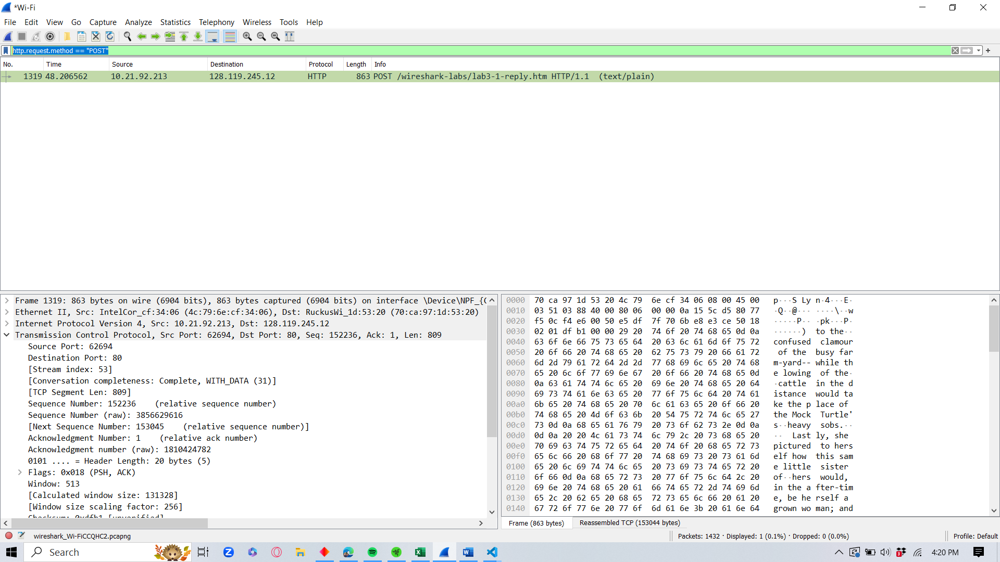
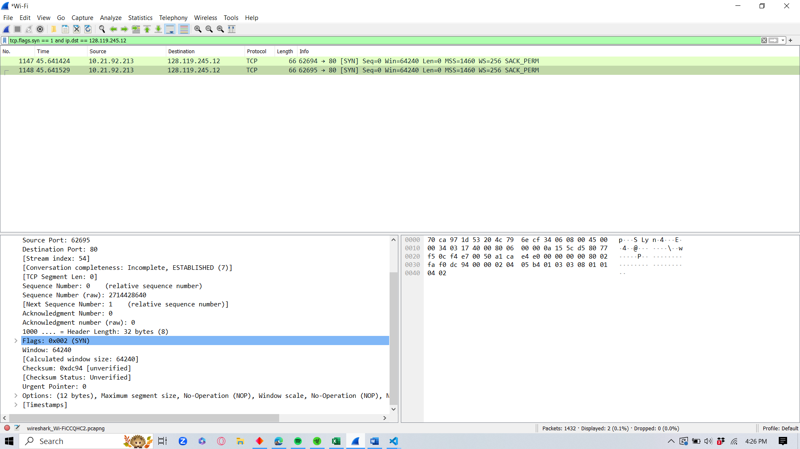
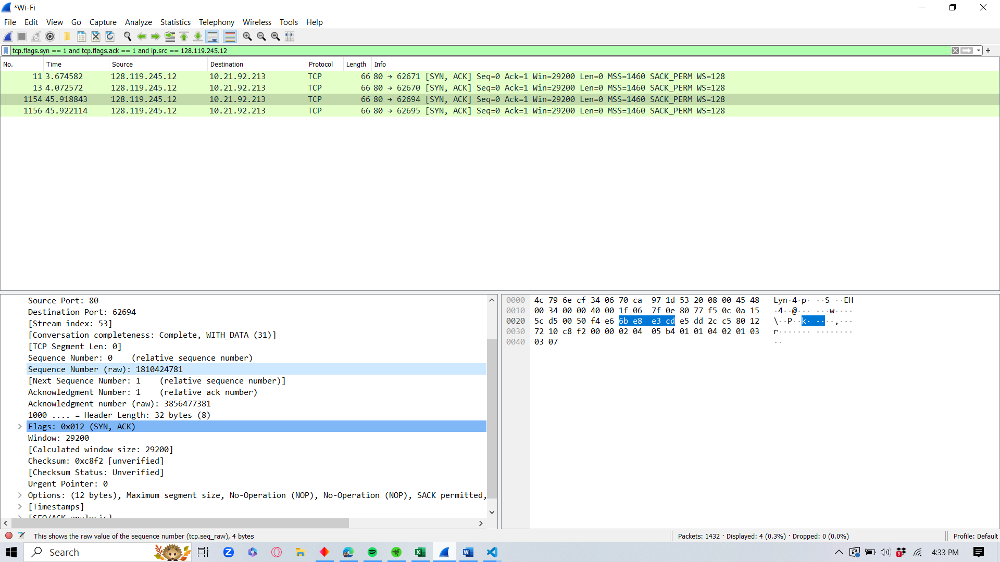
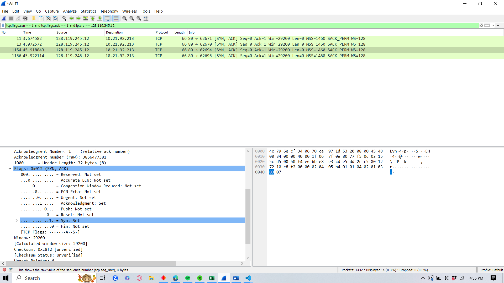
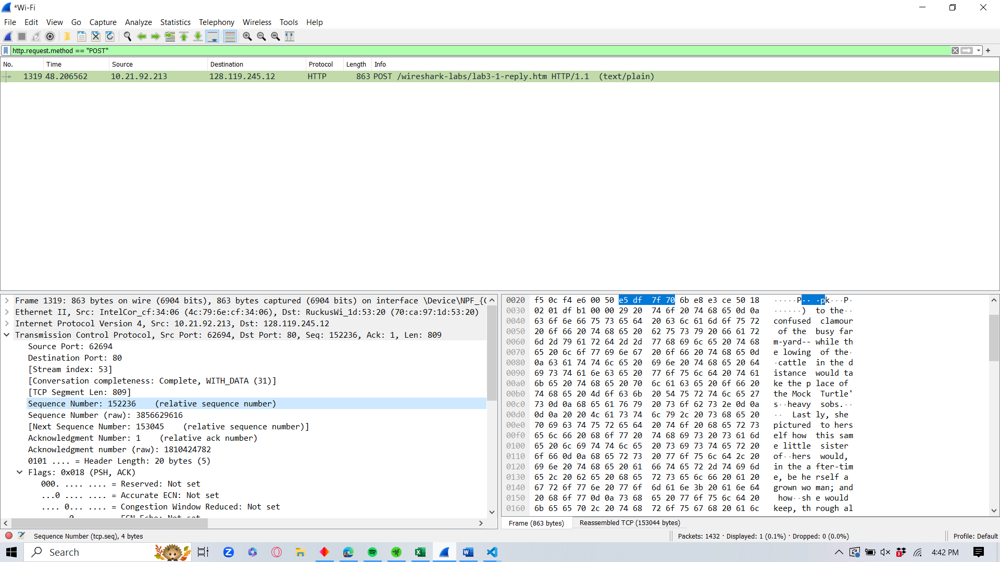
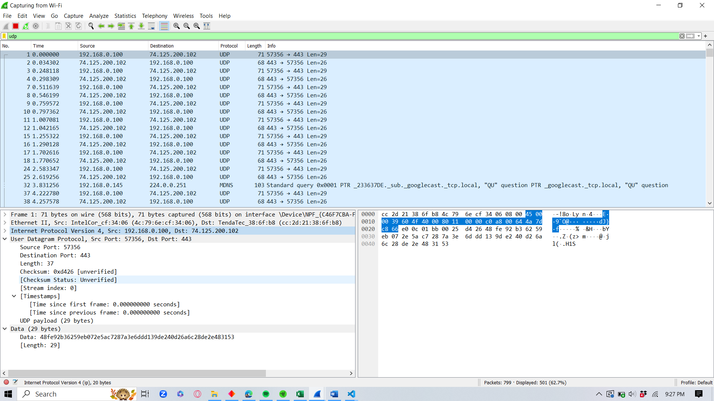
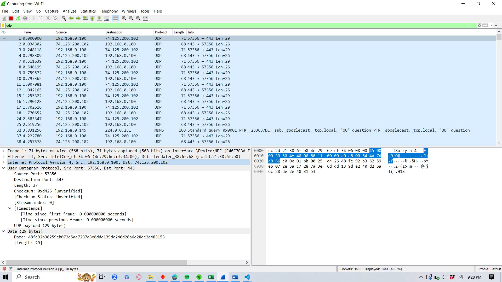
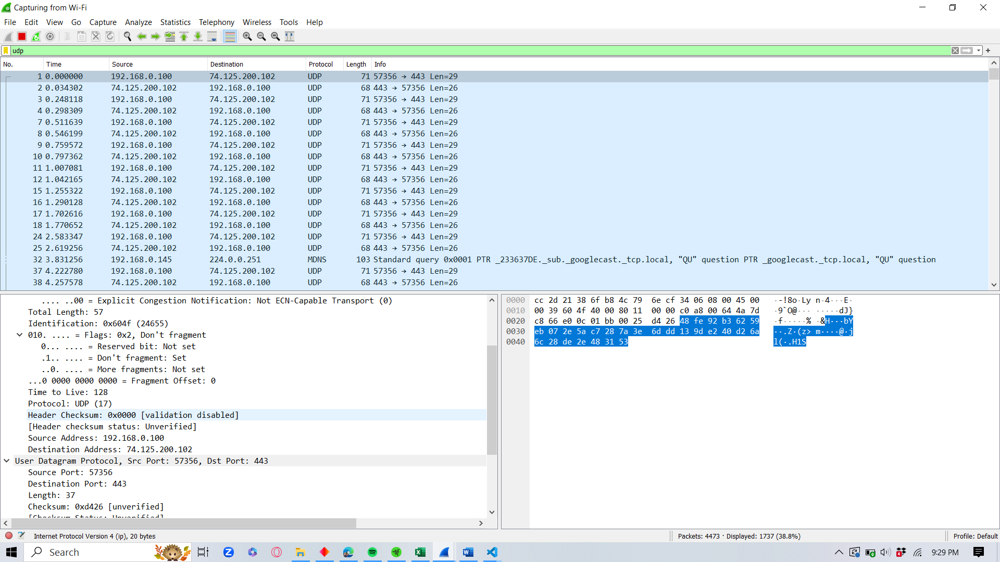

# Tugas Hands On TCP dan UDP Jarkom

- Adam Haidar Azizi (5025211114)

## TCP

### Soal 1 
> What is the IP address and TCP port number used by the client computer (source) that is transferring the alice.txt file to gaia.cs.umass.edu?

#### Jawaban 
> Filter dengan `http.request.method == "POST"` untuk mendapatkan packet dengan protocol HTTP dan memiliki metode POST.

> Didapatkan IP dari client 10.21.92.213 dengan source 62694

### Soal 2
What is the IP address of gaia.cs.umass.edu ? On what port number is it sending and receiving TCP segments for this connection ?

####
> Filter dengan `http.request.method == "POST"` untuk mendapatkan packet dengan protocol HTTP dan memiliki metode POST.

> Didapatkan IP gaia.cs.umass.edu adalah 128.119.245.12 dengan port 80

### Soal 3
> What is the sequence number of the TCP SYN segment that is used to initiate the TCP connection between the client computer and gaia.cs.umass.edu ?
#### Jawaban
> Filter dengan `tcp.flags.syn == 1 and ip.dst == 128.119.245.12` untuk mendapatkan packet yang memiliki flag TCP SYN dengan tujuan ke gaia.cs.umass.edu

> RAW Sequence Numbernya adalah Sequence Number (raw): 2714428640

### Soal 4
- What is the sequence number of the SYNACK segment sent by gaia.cs.umass.edu to the client computer in reply to the SYN ?
  - What is it in the segment that identifies the segment as a SYNACK segment ?
  - What is the value of the Acknowledgement field in the SYNACK segment ?
  - How did gaia.cs.umass.edu determine that value ?
#### Jawaban
> Masukkan filter `tcp.flags.syn == 1 and tcp.flags.ack == 1 and ip.src == 128.119.245.12` untuk menampilkan packet yang merupakan respon SYN/ACK dari gaia.cs.umass.edu ke client.
##### Raw Sequence Number  4

> Sequence Number (raw): 1810424781
##### Synack Number 4

> Segment SYN/ACK digunakan saat menginisiasi koneksi TCP karena kedua tanda tersebut diatur atau memiliki nilai 1.
##### Acknowledgement Field 4
> Acknowledge Field dari packet tersebut adalah 1.
##### Explanation 4 TCP
> gaia.cs.umass.edu menentukan nilai Acknowledgment field dalam SYN/ACK segment dengan menambahkan 1 ke nomor urutan yang diterima dari paket SYN. Ini adalah aturan umum dalam protokol TCP bahwa Acknowledgment number dalam paket SYN/ACK adalah hasil penambahan 1 dari nomor urutan yang diterima sebelumnya (dalam paket SYN).

### Soal 5
> What is the sequence number of the TCP segment containing the header of the HTTP POST command ?
#### Jawaban
> Filter dengan `http.request.method == "POST"` untuk mendapatkan packet dengan protocol HTTP dan memiliki metode POST.

> Sequence Number: 152236    (relative sequence number)
> Sequence Number (raw): 3856629616

### Soal 6
> Consider the TCP segment containing the HTTP “POST” as the first segment in the data transfer part of the TCP connection
- At what time was the first segment (the one containing the HTTP POST) in the data-transfer part of the TCP connection sent ?  
- At what time was the ACK for this first data-containing segment received ? 
- What is the RTT for this first data-containing segment ? 

#### Jawaban
> Filter dengan `http.request.method == "POST"` untuk mendapatkan packet dengan protocol HTTP dan memiliki metode POST.
##### Arrival Time
> Arrival Time: Oct 16, 2023 16:13:30.385230000 SE Asia Standard Time

##### Receiving Time
> Arrival Time: Oct 16, 2023 16:13:30.635193450 SE Asia Standard Time

##### RTT
> RTT = 0.249963450

### Soal 7
> lenghts is 863

## UDP
### Soal 1 

> Packet Number 10
> 4 Fields: 

### Soal 2
> Total 8 bytes

### Soal 3

> 37 is the value of total size of the packet, as it is the total sum of UDP header (8 bytes) + UDP payload (29 bytes)

### Soal 4
 . It's basically 65.535 (16 bit field) - 8 (header) = 65.527 bytes

### Soal 5
> The largest source port available is 65535 

### Soal 6

> Protocol UDP no 17

### Soal 7
The initial packet is labeled as number 1, while the subsequent one is identified as number 2. The source port number from the first packet is now the destination port in the second packet, and conversely, the destination port from the first packet has become the source port in the second packet.
